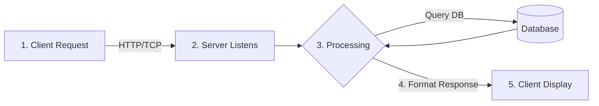

***

# Client-Server Architecture in Networking

## 1. Introduction
**Client-Server Architecture** is a distributed application structure that partitions tasks or workloads between the providers of a resource or service, called **Servers**, and service requesters, called **Clients**.

It is the foundational model for the modern Internet, email, banking systems, and database management.

### The Basic Analogy
Think of a restaurant:
*   **You (The Client):** You sit at a table, look at the menu, and ask the waiter for a specific dish.
*   **The Kitchen (The Server):** The kitchen has the resources (food, chefs, equipment). It prepares the dish upon request and sends it back to you.

---

## 2. Key Components

### A. The Client
*   **Role:** The initiator. It sends requests to the server.
*   **Nature:** Usually a desktop, laptop, smartphone, or tablet.
*   **Software:** Uses client-side software (Web browsers like Chrome, email apps like Outlook, or custom apps).
*   **Processing:** "Thin Client" logic—mostly handles the user interface (UI) and display, relying on the server for heavy data processing.

### B. The Server
*   **Role:** The provider. It listens for network requests, processes them, and sends back data.
*   **Nature:** High-performance computers with powerful CPUs, massive RAM, and redundant storage (RAID).
*   **Software:** Runs daemon processes (e.g., Apache Web Server, MySQL Database Server).
*   **Processing:** "Fat Server" logic—handles business logic, database queries, and security.

### C. The Network & Middleware
*   **Transport:** Usually runs over TCP/IP networks (Internet or LAN).
*   **Middleware:** Software that bridges the gap between client and server (APIs, JSON, XML).

---

## 3. How it Works (The Request-Response Cycle)

1.  **Request:** The client establishes a connection to the server and sends a request (e.g., "Load google.com").
2.  **Listening:** The server, constantly listening on a specific **Port** (e.g., Port 80 for Web), accepts the connection.
3.  **Processing:** The server interprets the request, maybe queries a database, and generates the data.
4.  **Response:** The server sends the data back (HTML code, JSON data, or an image) along with a status code (e.g., `200 OK` or `404 Not Found`).
5.  **Termination:** The connection is usually closed or kept alive for further requests.

---

## 4. Types of Client-Server Architecture

### Tier 1: Two-Tier Architecture
*   **Structure:** Client <--> Server (Database).
*   **Logic:** The client handles both the UI and some business logic; the server is mostly just the database.
*   **Pros:** Simple, fast development.
*   **Cons:** Hard to maintain logic on every client PC; security risks.

### Tier 2: Three-Tier Architecture (Most Common)
*   **Structure:** Client (Presentation) <--> Application Server (Business Logic) <--> Database Server (Data).
*   **Logic:** The "Middle Tier" handles the processing.
*   **Pros:** Scalable, secure, easier to update logic without touching clients.
*   **Example:** A web browser asks a Python server for data; the Python server asks PostgreSQL for the data.

### Tier 3: N-Tier Architecture
*   **Structure:** Highly complex systems with multiple layers (Load Balancers, Cache Layers, API Gateways, Microservices).

---

## 5. Advantages and Disadvantages

| Advantages | Disadvantages |
| :--- | :--- |
| **Centralized Data:** Easy backup and security management. | **Single Point of Failure:** If the server crashes, all clients stop working. |
| **Scalability:** You can upgrade the server hardware without touching clients. | **Traffic Congestion:** Too many requests can slow down the server. |
| **Security:** Data is stored on the server, not on vulnerable client devices. | **Cost:** High-performance servers and maintenance are expensive. |
| **Efficiency:** Clients don't need powerful hardware. | **Dependency:** Requires a stable network connection. |

---

# 30 Multiple Choice Questions (MCQs)

**1. In Client-Server architecture, which component initiates the request?**
   a) Server
   b) Client
   c) Router
   d) Database

**2. Which of the following is an example of a Client-Server application?**
   a) BitTorrent
   b) Web Browsing (HTTP)
   c) Skype (P2P calling)
   d) Windows Workgroup networking

**3. In a typical web scenario, what acts as the Client?**
   a) Apache Server
   b) The Web Browser
   c) The Operating System
   d) The HTML file

**4. What is the primary role of the Server?**
   a) To display the user interface
   b) To manage network cables
   c) To listen for requests and provide resources
   d) To initiate connections

**5. Which architecture separates the application into Presentation, Logic, and Data tiers?**
   a) Single-Tier
   b) Two-Tier
   c) Three-Tier
   d) Peer-to-Peer

**6. Which protocol is primarily used for secure Client-Server web communication?**
   a) HTTP
   b) FTP
   c) HTTPS
   d) SMTP

**7. A "Fat Client" implies:**
   a) A client that performs significant processing logic
   b) A client with a large screen
   c) A client that only displays data
   d) A client connected via fiber optics

**8. Which of the following is a disadvantage of Client-Server architecture?**
   a) Data inconsistency
   b) Single point of failure
   c) Difficulty in backing up data
   d) Requires complex client hardware

**9. In a Database Server environment, what language is typically used by the client to request data?**
   a) HTML
   b) SQL
   c) CSS
   d) Python

**10. Which port does a Web Server typically listen on for unsecured traffic?**
    a) 21
    b) 25
    c) 80
    d) 443

**11. Email transmission from a client to a mail server uses which protocol?**
    a) POP3
    b) IMAP
    c) SMTP
    d) HTTP

**12. The term "Scalability" in Client-Server refers to:**
    a) The ability to measure network speed
    b) The ability to handle growing amounts of work
    c) The ability to secure data
    d) The ability to code in multiple languages

**13. In a Three-Tier architecture, the middle tier is responsible for:**
    a) Data Storage
    b) User Interface
    c) Business Logic / Processing
    d) Routing packets

**14. Which component usually has higher hardware specifications (RAM, CPU)?**
    a) The Client
    b) The Server
    c) The Switch
    d) The Modem

**15. What happens if the server goes down in a Client-Server network?**
    a) Clients can still share files with each other
    b) The network functionality for that service stops
    c) The clients automatically become servers
    d) Data is lost permanently

**16. Which of these is a Server-side scripting language?**
    a) JavaScript (Client-side)
    b) HTML
    c) PHP
    d) CSS

**17. A client retrieves email from a server to read it locally. Which protocol is best for this?**
    a) SMTP
    b) FTP
    c) POP3
    d) DHCP

**18. Which architecture is cheaper to set up for a very small network (e.g., 3 computers)?**
    a) Client-Server
    b) Peer-to-Peer
    c) Mainframe
    d) Cluster

**19. Middleware in Client-Server architecture helps in:**
    a) Connecting the monitor to the CPU
    b) Bridging the gap between client and server requests
    c) Cooling the server room
    d) Managing power supply

**20. Which HTTP status code indicates "Server Error"?**
    a) 200
    b) 301
    c) 404
    d) 500

**21. A "Thin Client" is best described as:**
    a) A powerful desktop computer
    b) A terminal that relies on the server for processing
    c) A laptop with low battery
    d) A server with minimal RAM

**22. Which service automatically assigns an IP address to a client when it joins the network?**
    a) DNS
    b) DHCP
    c) FTP
    d) HTTP

**23. DNS (Domain Name System) translates:**
    a) Binary to Hexadecimal
    b) IP Address to MAC Address
    c) Domain Name to IP Address
    d) English to French

**24. Which of the following is NOT a benefit of Client-Server?**
    a) Centralized Security
    b) Backup Management
    c) Low cost of entry (Initial setup)
    d) Data Consistency

**25. In the Client-Server model, the relationship is typically:**
    a) Symmetric (Both do the same work)
    b) Asymmetric (One requests, one provides)
    c) Random
    d) Linear

**26. File Transfer Protocol (FTP) uses which port?**
    a) 21
    b) 22
    c) 23
    d) 25

**27. When you log into your bank account online, you are using:**
    a) A Peer-to-Peer network
    b) A Client-Server network
    c) A Local Area Network only
    d) A Bluetooth connection

**28. Which technique is used to distribute client traffic across multiple servers?**
    a) Encryption
    b) Load Balancing
    c) Hashing
    d) Caching

**29. A "Daemon" in server terminology is:**
    a) A virus
    b) A background process that listens for requests
    c) The client software
    d) The server hardware fan

**30. Why is data more secure in Client-Server than in P2P?**
    a) Because clients are always encrypted
    b) Because data is centralized on a secured server, not distributed on many PCs
    c) Because servers use wireless connections
    d) Because clients have firewalls

***

### Answer Key

| Q | Ans | Q | Ans | Q | Ans |
|---|-----|---|-----|---|-----|
| 1 | b   | 11| c   | 21| b   |
| 2 | b   | 12| b   | 22| b   |
| 3 | b   | 13| c   | 23| c   |
| 4 | c   | 14| b   | 24| c   |
| 5 | c   | 15| b   | 25| b   |
| 6 | c   | 16| c   | 26| a   |
| 7 | a   | 17| c   | 27| b   |
| 8 | b   | 18| b   | 28| b   |
| 9 | b   | 19| b   | 29| b   |
| 10| c   | 20| d   | 30| b   |
